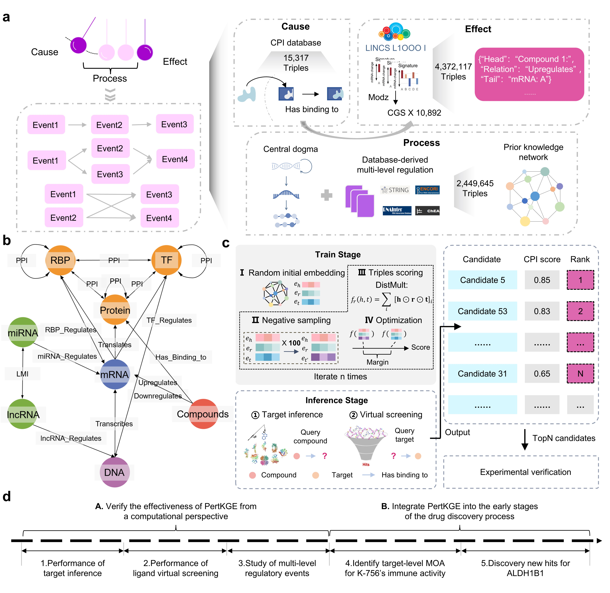

# PertKGE
PertKGE is a method designed to improve compound-protein interaction with knowledge graph embedding of transcriptomic perturbation profiles./
This repo contains a PyTorch implementation for PertKGE

## Requirements
Dependencies (with python >= 3.7): 
Main dependencie is [TorchKGE](https://github.com/torchkge-team/torchkge/tree/master)  
Others and detailed version can be touched in requirements.txt

## Demo
We proviewed demo to reproduce EXPERIMENT 1 (target inference scenario I) in our paper.

## Notes
FUll Data & Code will coming soon!
