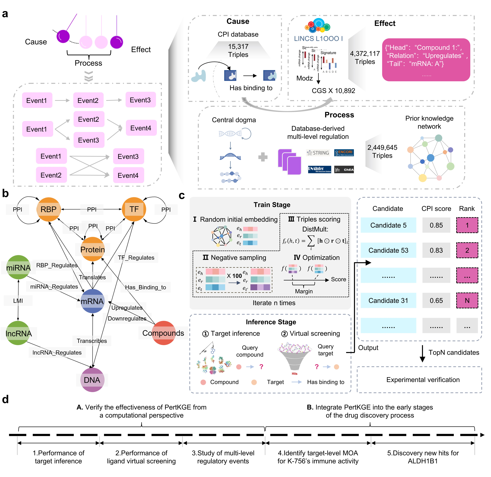

# Identify compound-protein interaction with knowledge graph embedding of transcriptomic perturbation profiles
This repo contains a PyTorch implementation for PertKGE, which is model proposed in a paper: Identify compound-protein interaction with knowledge graph embedding of transcriptomic perturbation profiles.

## Brief introduction
PertKGE is a method designed to improve compound-protein interaction with knowledge graph embedding of transcriptomic perturbation profiles.The key is to construct a chemical perturbation profiles-based knowledge graph that breaks down genes into DNAs, messenger RNAs (mRNAs), long non-coding RNAs (lncRNAs), microRNAs (miRNAs), transcription factors (TFs), RNA-binding proteins (RBPs) and other protein-coding genes. This enables PertKGE to consider various fine-grained interactions between genes to simulate post-transcriptional and post-translational regulatory events in biological system, which intuitively aligns more closely with real world cellular responses to chemical perturbations.\


## Requirements
To run our code, please install following main dependency packages
```
python         3.7
torch          1.13.1
torchkge       0.17.5
numpy          1.21.5
pandas         1.1.5
tqdm           4.64.1
cmapPy         4.0.1
```
Others and detailed version can be touched in requirements.txt, conda environment is also recommended

## Demo
We proviewed demo to reproduce *Target inference scenario I* in our paper.

## Notes
FUll Data & Code will coming soon!
