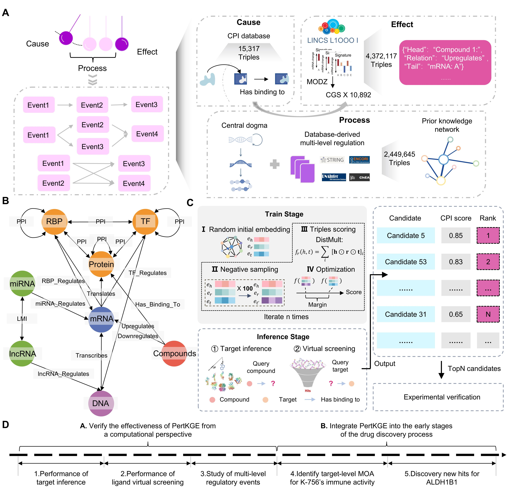
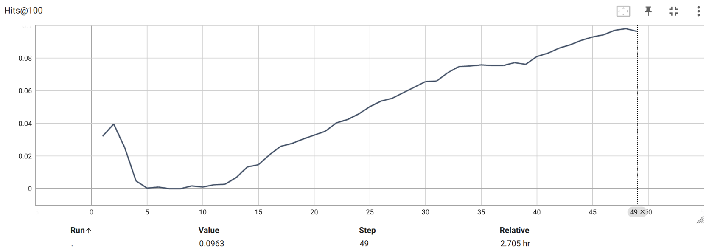

# Identify compound-protein interaction with knowledge graph embedding of perturbation transcriptomics
This repo contains a PyTorch implementation for PertKGE, which is model proposed in our paper **"Identifying compound-protein interactions with knowledge graph embedding of perturbation transcriptomics"**.

## Brief introduction
PertKGE is a method designed to improve compound-protein interaction with knowledge graph embedding of perturbation transcriptomics.The key is to construct a biologically meaningful knowledge graph that breaks down genes into DNAs, messenger RNAs (mRNAs), long non-coding RNAs (lncRNAs), microRNAs (miRNAs), transcription factors (TFs), RNA-binding proteins (RBPs) and other protein-coding genes. This enables PertKGE to consider various fine-grained interactions between genes to simulate post-transcriptional and post-translational regulatory events in biological system, which intuitively aligns more closely with real world cellular responses to chemical perturbations.\


## Requirements
To run our code, plz install following main dependency packages:
```
python         3.7
torch          1.13.1
torchkge       0.17.5
numpy          1.21.5
pandas         1.1.5
tqdm           4.64.1
cmapPy         4.0.1
```
Others and detailed version can be touched in requirements.txt, conda environment is also recommended

## Demo
We provided demo to reproduce **Target inference scenario I** in our paper.

## Running PertKGE  
### Training Staget
To train PertKGE, plz using following cmd:
```
$ cd src/
$ python train_pertkge.py --cause_file "../processed_data/target_inference_1/cause.txt"
                          --process_file "../processed_data/knowledge_graph/process.txt"
                          --effect_file "../processed_data/target_inference_1/effect.txt"
                          --test_file "../processed_data/target_inference_1/test.txt"
                          --h_dim 300
                          --margin 1.0
                          --lr 1e-4
                          --wd 1e-5
                          --n_neg 100
                          --batch_size 2048
                          --warm_up 10
                          --patients 5
                          --warm_up 10
                          --load_processed_data
                          --processed_data_file "../processed_data/target_inference_1/"
                          --save_model_path "../best_model/target_inference_1/"
                          --task "target_inference"
                          --run_name "target_inference_1"
```

  
It is necessary to note that we use **unbiased evaluator** to monitor training process and perform early stopping.By using unbiased evaluator, We find that PertKGE first fits the dataset bias and starts learning the causal mapping at 10 epochs, which may explain why we set warm-up to 10.\


### Inference Staget
During the inference stage, users can query PertKGE with a compound or target of interest, depending on their objective, such as target inference or ligand VS.

Users can follow the cmd in **target_inference.ipynb**.

## Baseline
In this work, we compare to following baseline in different settings
```
# Target Inference
CMap, De, DeMAND, ProTINA, FL-DTD, SSGCN

# Virtual Screening
SSGCN, Glide-SP

# Unbiased test
HetioNet, BioKG, PrimeKG
```
[**CMap**](https://clue.io/) and [**FL-DTD**](http://menglab.pub/fldtd/) were tested in their website. **DeMAND package** was installed through [Bioconductor](https://www.bioconductor.org/packages/release/bioc/html/DeMAND.html). To test **ProTINA**, plz refer to [this repo](https://github.com/CABSEL/ProTINA/tree/master). 
We recommend to test **SSGCN** using [pytorch version](https://github.com/myzhengSIMM/SSGCN).  
  
**Glide-SP** is performed using Maestro of Schrödinger Suites (version 2020-4), and obtained poses were analyzed with PyMOL. [**Grid files**](https://drive.google.com/drive/folders/1wPcn7EaQldWbXONrRVd-ZOcBsNo6IXHw?usp=drive_link) are provided.  

To get other biomedical knowledge graph for comparation, plz refer to [HetioNet](https://github.com/hetio/hetionet/tree/main), [BioKG](https://github.com/dsi-bdi/biokg), [PrimeKG](https://github.com/mims-harvard/PrimeKG). We also provide processed version in Data section.

## Notes
```
3/19      Upload data and model weight for "Secondary pharmacology study of K-756 by PertKGE"
3/20      Upload data and model weight for "PertKGE identified five new scaffold hits for ALDH1B1"
```
FUll Data & Code will coming soon!
